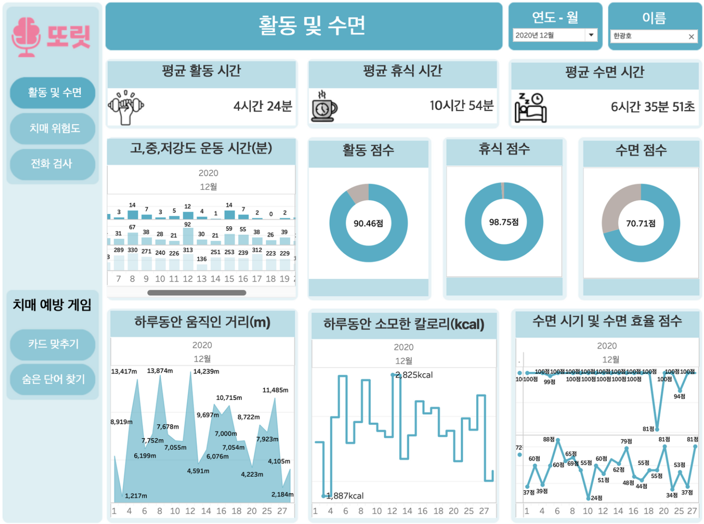
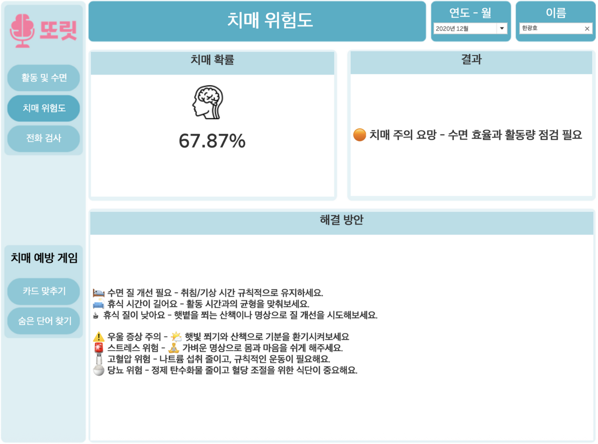
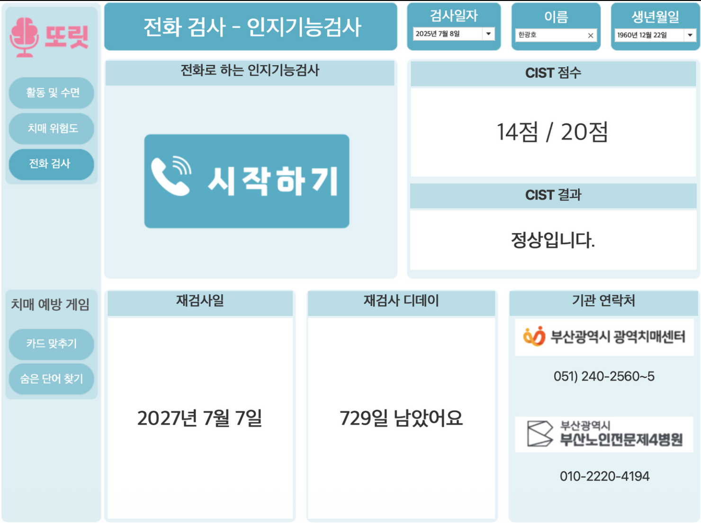
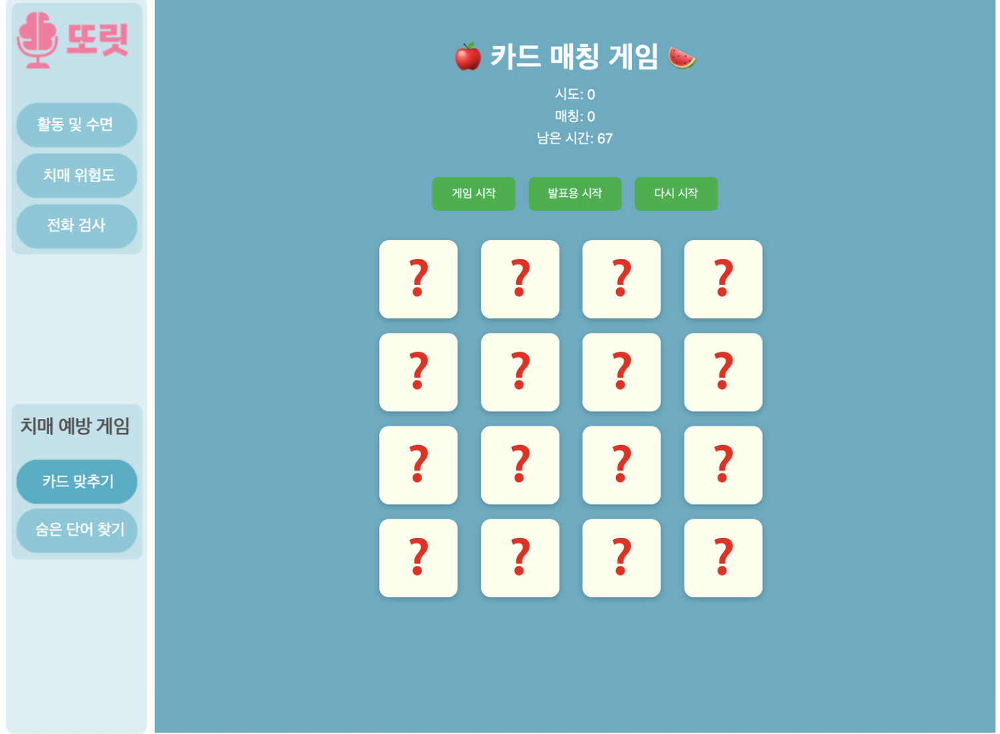
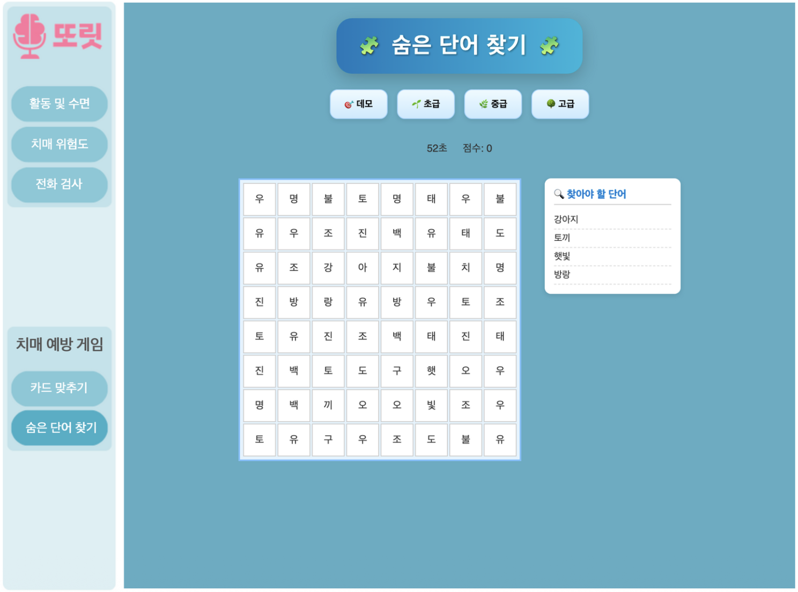

# 📊 Dashboard

본 프로젝트는 고령자의 치매 예방을 위해 **활동·수면 데이터 분석**, **AI 치매 예측**, **음성 기반 인지기능검사**, **인지훈련 게임**을 하나의 대시보드에서 제공합니다.

---

## 🏃 Activity & Sleep Dashboard

사용자의 활동량과 수면 데이터를 시각화하여 건강 상태를 한눈에 확인할 수 있습니다.

### 주요 기능

- 평균 활동시간 및 휴식시간 분석
- 평균 수면시간 및 수면 점수 제공
- 활동량 추이 시각화
- 칼로리 소모량 분석
- 수면 효율 분석

  

---

## 🧠 Dementia Risk Prediction Dashboard

AI 모델을 활용하여 치매 발생 위험도를 예측하고 개인 맞춤형 건강관리 방안을 제공합니다.

### 주요 기능

- 치매 위험도(%) 예측
- 위험 단계 안내
- 생활습관 기반 개선 방안 제공

  

---

## 🎙️ Voice-based Cognitive Screening Dashboard

NAVER CLOVA STT와 GPT 기반 CIST 인지기능검사를 수행하고 검사 결과를 제공합니다.

### 주요 기능

- 전화 기반 인지기능검사
- CIST 점수 산출
- 정상 여부 판정
- 재검사 일정 관리
- 치매안심센터 연락처 제공

  

---

## 🃏 Memory Card Game

기억력 향상을 위한 카드 매칭 게임입니다.

### 주요 기능

- 카드 짝 맞추기
- 제한 시간 제공
- 음성 안내(TTS)
- 점수 및 시도 횟수 기록

  

---

## 🔤 Word Search Game

주의력과 인지능력 향상을 위한 숨은 단어 찾기 게임입니다.

### 주요 기능

- 난이도 선택
- 랜덤 단어 생성
- 제한 시간 및 점수 시스템
- 단어 탐색 기능

  

## 📦 Tableau Dashboard (.twbx)
대시보드 원본은 dementia_dashboard.zip에서 확인할 수 있습니다.
