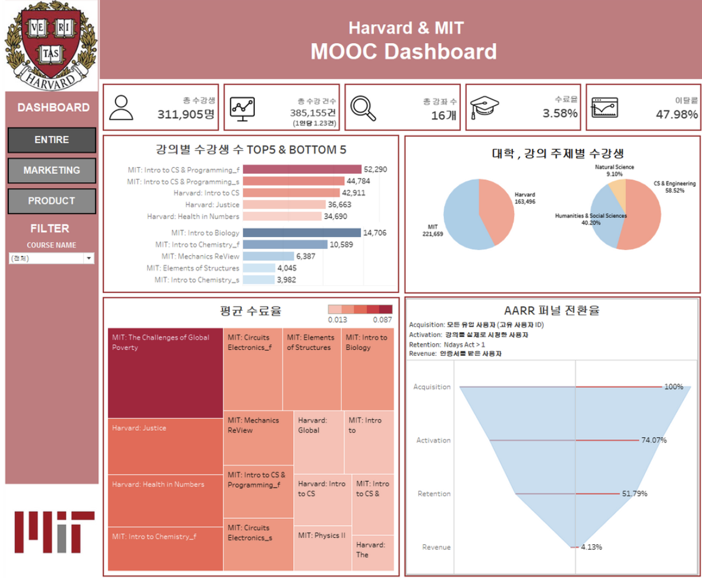
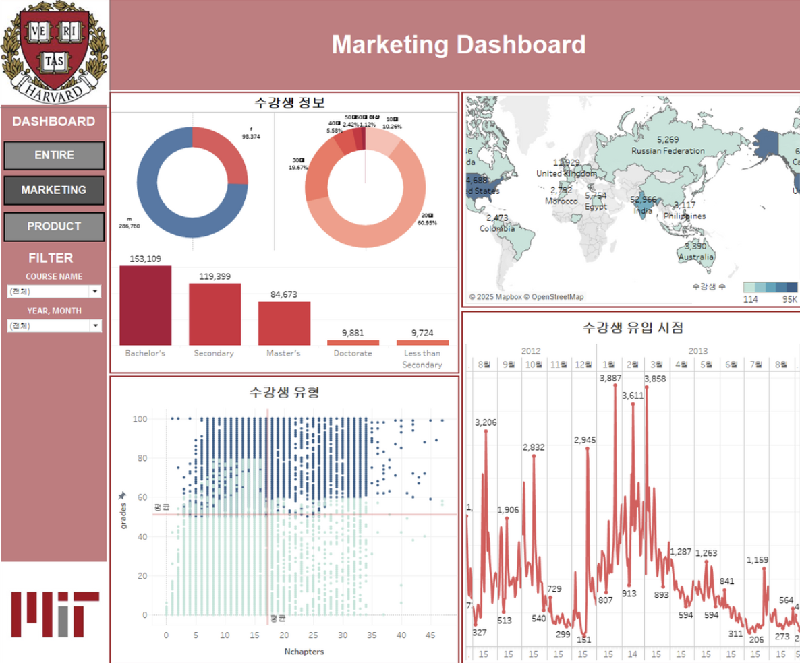
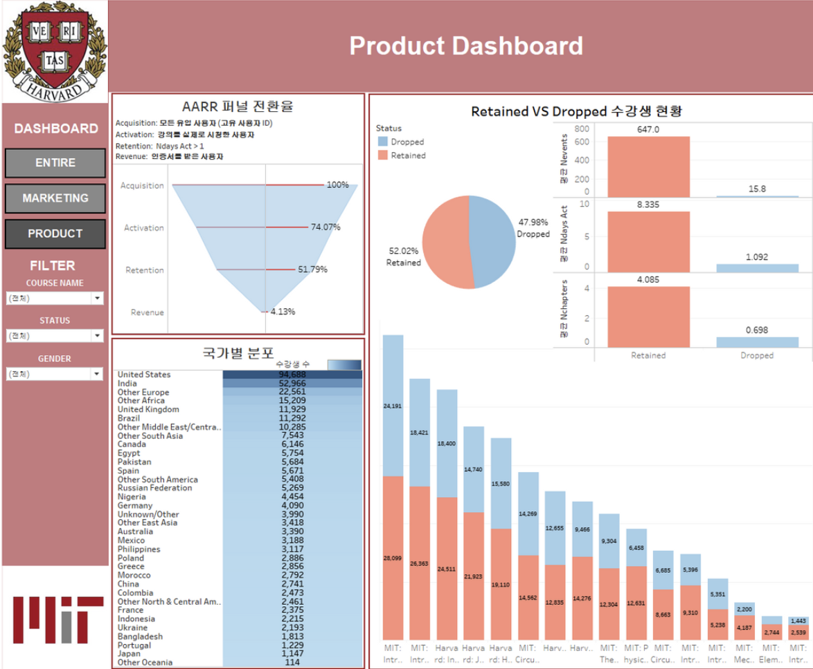

# 📊 Dashboard

본 프로젝트는 Tableau를 활용하여 **MOOC 플랫폼의 수강생 현황과 학습 행동을 분석**하고,  
수강생의 유입부터 수료까지의 과정을 **AARR Funnel**로 시각화했습니다.

---

## 📚 Overview Dashboard

edX 플랫폼의 전체 수강생 및 강의 현황을 종합적으로 확인할 수 있는 대시보드입니다.

### 주요 기능

- 전체 수강생 및 총 수강 건수 등 핵심 KPI 제공
- 강의별 수강 인원 TOP 5 / BOTTOM 5 비교
- 대학 및 강의 주제별 수강생 분포 시각화
- 강의별 평균 수료율 Treemap 시각화
- Course Name 필터를 활용한 강의별 상세 분석
- Acquisition → Activation → Retention → Revenue 단계의 AARR Funnel 구축
- 단계별 전환율 및 이탈 현황 확인

  

---

## 📢 Marketing Dashboard

수강생의 인구통계학적 특성과 학습 행동을 분석하여 **마케팅 전략 수립에 활용할 수 있도록 구성한 대시보드**입니다.

### 주요 기능

- 성별·연령대·학력별 수강생 분포 분석
- 수강 주차별 성적 및 참여 현황 시각화
- 학습 여부와 수료 여부를 기준으로 수강생 유형 분류
- 수강생 국적 및 언어권 분포 분석
- 월별 수강생 유입 추이 확인
- 사용자 특성에 따른 타겟 마케팅 인사이트 제공

  

---

## 📈 Product Dashboard

AARR Funnel을 중심으로 수강생의 **유지·이탈 행동을 분석**하고, 강의 및 서비스 개선에 활용할 수 있도록 구성한 대시보드입니다.

### 주요 기능

- Acquisition → Activation → Retention → Revenue 4단계 Funnel 구축
- 단계별 전환율 및 이탈률 시각화
- 국가별 수강생 유지·이탈 현황 분석
- 유지·이탈 사용자별 활동 지표 비교
- 강의별 유지·이탈 비율 분석
- Course Name 필터를 활용한 강의별 사용자 행동 분석

  

